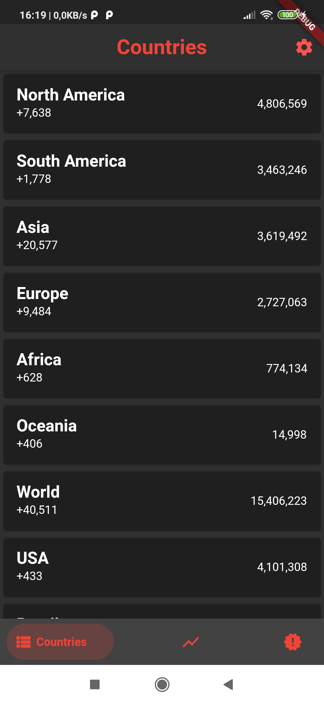
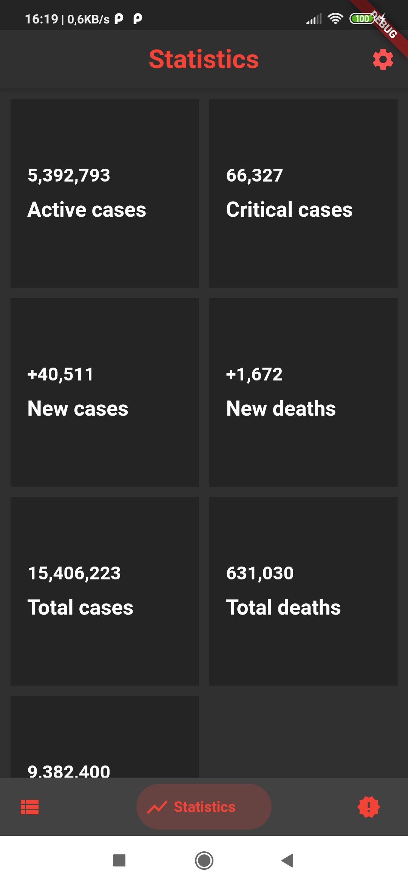

Corona News

 

---

## Screenshots

    <table>
        <tr>
            <td style="text-align: center">
                    
            </td>            
            <td style="text-align: center">
                    
            </td>
            <td style="text-align: center">
                    
            </td>
        </tr>
    </table>

Icons made by <a href="https://www.flaticon.com/authors/pixel-perfect" title="Pixel perfect">Pixel perfect</a> from <a href="https://www.flaticon.com/" title="Flaticon"> www.flaticon.com</a>

