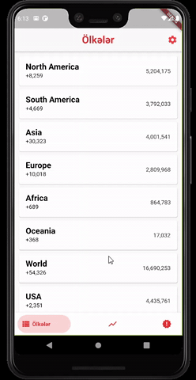
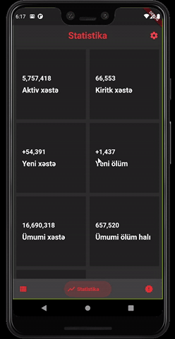
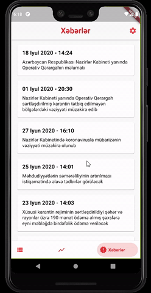

Corona News

 

## Pages

    <table>
        <tr>
            <td style="text-align: center">
                    
            </td>            
            <td style="text-align: center">
                    
            </td>     
            <td style="text-align: center">
                    
            </td>     
        </tr>
    </table>

Download apk from [here](https://drive.google.com/file/d/14O0TAxTn33ZbeAohYMhw-M--zP7T56N1/view?usp=sharing)

## Functionalities

- Internationalization
- Change Theme
- Get global statistics
- Get statistics of countries
- Get News about Corona-virus from [Repuclic of Azerbaijan Cabinet of Ministers](https://cabmin.gov.az/)

## Topics you can learn based on this app
- BLoC State Management using [Flutter Bloc](https://pub.dev/packages/flutter_bloc)
- [BLoC Architecture](https://bloclibrary.dev/#/architecture)
- Htpp Requests with [Dio](https://pub.dev/packages/dio)
- Writing Generic Classes
- `Single Responsibility`, `Interface Segregation` and `Dependency Inversion` principles
- Localization in Flutter
- Dynamic Theme changing in Flutter
- Using different size assets in Flutter
- Usage of Mixins, Extension methods, Slivers in Flutter
- Named Routing

## Maintainers
[Kanan Yusubov](https://github.com/yusubx)

Icons made by <a href="https://www.flaticon.com/authors/pixel-perfect" title="Pixel perfect">Pixel perfect</a> from <a href="https://www.flaticon.com/" title="Flaticon"> www.flaticon.com</a>

